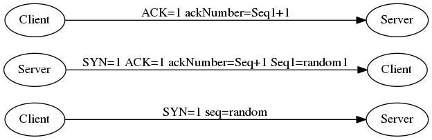
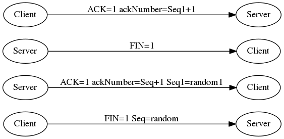

# BasicKnowledge
# Contents
[1.日期与问题](#questions)

[2.数据结构](#statics-structure)

[3.操作系统](#os)

[4.协议](#protocol)

[5.C/C++](#c-and-cpp)

[6.JAVA](#java)

[7.正则表达式](#regex)

## questions
- 3.21
    - 面试题: 进程与线程
    - C++: 宏
    - 数据结构: 单链表struct写
    - github markdown描点[](#)不支持中文标题  标题特殊符号C/C++
    
    
[返回目录](#contents)
## statics structure


[返回目录](#contents)
## os


[返回目录](#contents)
## protocol
- TCP三次握手、四次挥手
    - Seq(32 bit) ackNumber(32 bit) URG、ACK、PSH、RST、SYN、FIN(each 1 bit)
    - 三次握手：
    ```mermaid
    graph Shake3
    Client --> | SYN=1 Seq=random | --> Server
    Server --> | SYN=1 ACK=1 ackNumber=Seq+1 Seq1=random1 | --> Server
    Client --> | ACK=1 ackNumber=Seq1+1 | --> Server
    ```   
    
     
    - 四次挥手：
    ```mermaid
    graph Bye4
    Client --> | FIN=1 Seq=random | --> Server
    Server --> | ACK=1 ackNumber=Seq+1 Seq1=random1 | --> Server
    Server --> | FIN=1 | --> Client
    Client --> | ACK=1 ackNumber=Seq1+1 | --> Server    
    ```  
    
    
    
[返回目录](#contents)
## C AND CPP

[返回目录](#contents)
## JAVA

[返回目录](#contents)

## Regex
- 量词 贪婪 非贪婪
    - 量词
        - * 0或n 
        - + 1或n
        - ? 0或1
        - {n} {n,} {n,m}        
    - 贪婪: 量词后不加? 表示从?前到匹配?后的串n次
    - 非贪婪: 量词后加? 表示从?前到匹配?后的串成功一次就不再继续
- 获取 非获取
    - 获取: (pat)
    - 非获取
        - str(?:pat)  str后匹配pat
        - str(?=pat)  str后匹配pat
        - (?<=pat)str  str前匹配pat
        - str(?!pat)  str后匹配pat
        - (?<!pat)str  str前匹配pat
        
[返回目录](#contents)
