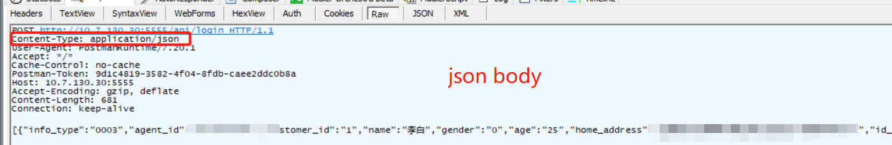

# PLANS 2019

## contents

[1.九月](#Sept)

[2.十一月](#Nov)

## 2019

### Sept

- **9.3**

    - git
        - git三区
            - [git教程](https://blog.csdn.net/qq_32452623/article/details/78417609)
            - 工作区 working directory
            - 缓存区 stage
            - 版本库 commit history
                - git diff 工作区 vs 暂存区
                - git diff head 工作区 vs 版本库
                - git diff --cached 暂存区 vs 版本库
    - Spring 自动配置
        - 注解
            - @EnableAutoConfiguration
            -
        - META-INF/spring.factories
        - 
- **9.4**
    - 制定符合现实的时间安排方案（中心思想：**合理，可实践性要强，实现的成本要底，收益要高，收益一定要可视化且确实有效**，最后这一点是针对有的可视化强但是没用，比如笔记记得很认真，但是看起来不知所云，实际上没有收获，心理上却认为认真地完成了什么事）
        - 碎片化时间利用方案：【十分钟can do】。培养对时间的认识，珍惜时间，增强自信，与【十分钟玩儿手机】产生对比，潜意识驱逐恶性快餐
            - 背单词
            - 学外语
            - 整理知识要点
            - 改进方案
                - 整理文档方案的持续改进，不要让整理的内容与思考白费
                - 
        - 块状时间利用方案：【三十分钟can do】。培养自信感，完成一件可以写下来的事情，注意力集中之后这个时间可以相应地延长，最长不能超过五十分钟
            - 工作内容
            - 阶段性目标
                - 这个需要制定周期，在周期前、中、后记录下当时的程度（疑惑、思考），以此培养收益感
            - 
        - 惯性时间利用方案：【定时/定任务must do】。培养责任意识
            - 回顾
                - 需要制定具体的周期曲线
                    - 一定要有规律，必须执行，考虑到是必须执行，执行的成本一定要非常低，提前把准备工作做好
                    - 
        - 娱乐时间奖励机制
            - 娱乐项目（最好是有益于改正自己的缺点、学习新的东西）
            - 

- **9.5**
    - linux命令
        - sed
        - grep
            - 抓取匹配的附近几行
        - awk
    - log4j2
        - slf4j
        - 打印到控制台、输出到文件
            - 都是一个输出的过程，只是输出的地方不同。打印到控制台是输出后，被控制台程序读入；输出到文件，就是追加写入或者覆盖写入文件
- **9.10**
    - stackTrace
        - [stackTrace/logger](https://stackoverflow.com/questions/1167888/how-do-i-increase-the-number-of-displayed-lines-of-a-java-stack-trace-dump)

### Nov
- **11.05**
    - zuul、ribbon、feign、hytrix功能与设置
        - zuul
            - 主要功能
                - 网关
                - 作为网关控制所有入出的形式与时间
            - 参数/时间
                - 容忍时长seondsA
                - 单次hytrix容忍时长secondsB
            - 场景
                - 接收到一个请求，seondsA计时器倒计时开始
                - 根据route配置拿到需要请求的微服务名alias
                - 向注册中心询问secondsB倒计时开始
                - 两种情况(假设secondsA远大于secondsB)
                    - - seondsB计时器倒计时停止，还未接收到返回的请求，返回error，同时熔断这个线程
                    - seondsB计时器还在倒计时，接收到返回的请求，返回响应数据
                - 发送请求
                - 两种情况
                    - seondsA计时器倒计时停止，还未接收到返回的请求，返回error，同时熔断这个线程
                    - seondsA计时器还在倒计时，接收到返回的请求，返回响应数据
        - ribbon
            - 主要功能
                - 负载均衡
            - 完成功能所需参数
                - 总共容忍时长secondsA
                - 每次重试容忍时长secondsB
                - 重试次数countC
            - 场景
                - 被高层调用，请求某个微服务，secondsC倒计时开始
                - 向注册中心询问secondsB倒计时开始
                - 两种情况(假设secondsC远大于secondsB)
                    - - seondsB计时器倒计时停止，还未接收到返回的请求，返回error，同时熔断这个线程
                    - seondsB计时器还在倒计时，接收到返回的请求，返回响应数据
                
        - feign
            - 主要功能
                - 服务间调用
                - 容忍时长
            - 
        - hytrix
            - 主要功能
                - **断连接**，作为别的有此类需求的底层,ribbon重试的容忍时间(对某ip发请求没得到回应熔断重试)和全局针对服务的hytrix容忍时间不一样
            - 时间/参数
                - 容忍时长secondsA
            - 场景
                - 向某个ip发起http请求，secondsA计时器倒计时开始
                - 

    - socket超时
        - connectTimeOut
        -readTimeOut
    - 数据库连接
        - 参考link
            - [MyBatis中链接、会话、事务介绍](https://my.oschina.net/yangjianzhou/blog/3030398)
        - 连接池
            - 一个连接池里有多个实际的连接
        - 实际的连接
            - 每次建立一条实际的连接需要使用配置
        - 连接会话
            - 一个实际的连接中可以产生多个逻辑session会话
        - 事务
            - 一个事务对应一个commit
            - 一个session就是一个commit吗？
- **11.06**
    - getter/setter
        - 需要反射给某个对象赋值的时候，为什么除了setter还需要有getter？
    - mybatis与pageHelper

- **11.18**
    - proxy
        - 原理
            - 分类
                - http代理
                - sockets5代理

        - windows
            - 代理设置
                - windows自带的系统代理
                    - 填写server ip:port
                    - 为哪些应用代理
                    - 相当于一个配置文件，应该是某个**接口**的配置文件，使用这个接口的就使用这个配置了，配置文件叫system proxy
                - proxifier
                    - 填写server ip:port
                    - 设置代理规则，为哪些应用代理
                        - default
                        - app
                - 浏览器配置的proxy
                    - 本应用(浏览器)选择哪个代理
            - 监听包的代理服务器
                - ssr
                    - 设置port，起了一个服务器，在这个port监听，如果有应用将这个ip(localhost或者其他):port设为代理服务器，包就发到这儿
                    - 选择server ip:port
                    - 设置代理规则
                        - global 这个不是针对整个OS而言的，而是对到了ssr的包全部代理
                        - PAC 按规则
                        - disable system proxy 对到了ssr的包全部不代理
                - fidder
                    - 起一个server服务，监听port端口
    - vpn
        - 
    - 上下文
        - 引入。同样的一个词语，在不同的句子中含义不同；同样的一个句子，在不同的语境中含义不同。之所以会不同，就是因为这个词语/句子所在的上下文不同。用到变量身上，也就是对于源码的阅读者来说同样的变量a，在源码中不同的位置，也就是处于不同的上下文中，含义不同。例如全局变量，函数内的局部变量，等等。
            - 上下文实例。如果我们在一本书导读写道'&'符号代表字符串'and'，那么这句话，由于我们在书这个上下文看到，所以我们默认这句话的作用域是整本书；如果我们在第一章读到'&'符号代表'and more'字符串，我们认为这句话在第一章内有效，第二章还是代表的'and'。
            - 上下文特例。那么，如果我们在第一章的第三节，'&'代表'and me'，而且我们想要把这个定义一直用到这部分相关的内容结束为止，也就是甚至不局限于第几章的问题，而是这块儿的都要用这个定义，那么我们需要将它的上下文扩大，而不是设为第一章了。但是它和导读里的全局变量还是不同的，因为它不知道什么时候结束，但是会结束，而全局变量，生命周期是和整本书一致的。要注意的是，当看完了这部分，就要及时把这个销毁。否则这些失效的定义将挤占很大的空间，从而导致内存溢出。
    - 隧道
        - 广义
            - 不看里面的东西，直接使用自己的隧道协议传输
            - http隧道
            - ip隧道
- **11.19**
    - [ip位置查询网址](https://db-ip.com/api/pricing/) curl http://api.db-ip.com/v2/free/${ip}
    - timeout
        - 一次完整的请求、响应过程
            - 发起握手请求
            - 握手成功，成功建立tcp连接
            - 开始写数据，发送，等待回应(也就是开始了读的线程，轮询或者监听是否有数据返回)
            - 开始接收数据
            - 接收数据完毕
            - tcp挥手
            - tcp挥手完毕
        - 请求超时、响应超时、读超时
            - 请求超时，长时间未能tcp握手
            - 响应超时，tcp握手成功后，未能得到响应
            - 读超时，得到响应后，读数据超时
        - socket timeout
        - connect timeout
        - read timeout
    - mysql
        - show processlist;
        - show OPEN TABLES where In_use > 0;
        - SELECT * FROM INFORMATION_SCHEMA.INNODB_LOCKS; 
        - SELECT *FROM mysql.slow_log;
    - 根证书
        - 被用户信任为根证书后能做什么
            - 为别的网站背书，颁发证书
                - 根证书为别的证书颁发机构背书
                - 根证书颁发证书
            - 根证书为钓鱼网站背书
                - 浏览器不会报警，用户不会察觉
                - 
            - 获取加解密方式，服务器与客户端的私钥公钥，截获后伪装等等，https实际上又变回了http
        - 证书签名
            - sha-1
            - sha-2/sha-256/sha-2 384 
                - sha-2是sha-1的加强版，256是hash位数也就是长度，384是二进制长度
    - 网络安全
        - [实例](https://www.zhihu.com/question/22779469) [blog](https://www.cnblogs.com/index-html/)
        - ssltrip
        - cookie
            - 第三方读写
                - 网站notification说，需要追踪您的cookie提供服务，是否同意，这个意味着什么？
                - google怎么实现的追踪用户记录，广告投放
                -  只读？
                - __cookie是什么(js怎么读cookie)？
    - base64
        - 图片转换
            - 161kb的图转为base64变为1.2M?
                - 大小计算
                - 每六个bit改为八个，加00
            - data前缀 
- **11.20**
    - dns
        - chrome清除dns缓存
            - 设置>>显示高级设置...>>去掉“预提取资源，以便更快速地加载网页”前的勾选
            - chrome://net-internals/#dns clean host cache
        - windows
            - 清除dns缓存
                - ipconfig/displaydns
                - ipconfig/flusdns
            - 勾选自动获取dns(这个是适配器默认配置)，会从网关进行dns服务器的配置，容易被dns劫持 
        - nslookup
            - 查看dns和域名 
            - Non-authoritative answer，出现此提示表明该域名的解析是从local DNS的cache中直接读出来的，而不是local DNS向真正负责这个域名的name server问来的
            - ping、tracert/traceroute(linux中有个strace记录命令log相当好用)、mtr
                - ping和nslookup解析的ip不同
                    - ping 系统缓存、hosts、缓存服务器、主服务器、辅服务器
                    - nslookup dns服务器、本地缓存
                - cdn Content Delivery Network
            - nload等一些工具可以读取"proc/net/dev"文件，以获得流量统计信息；而一些工具使用pcap库来捕获所有数据包，然后计算总数据量，从而估计流量负载。
                - 监控总体带宽使用――nload、bmon、slurm、bwm-ng、cbm、speedometer和netload
                - 监控总体带宽使用（批量式输出）――vnstat、ifstat、dstat和collectl
                - 每个套接字连接的带宽使用――iftop、iptraf、tcptrack、pktstat、netwatch和trafshow
                - 每个进程的带宽使用――nethogs
                - dig、netstat
        - dns劫持与dns欺骗
            - dns欺骗是dns服务器返回了正确的结果，但是被恶意修改了(通过劫持路由器等手段)
            - dns劫持是直接劫持了dns服务器，dns服务器返回的就是恶意的结果
    - svn
        - 合版的起点
        - rebase的必要性
    - tcp连接与socket
        - 什么是建立tcp连接
            - 代码中，我们在client打开一个socket，在服务器端开一个socket监听，client的socket会有一个client的ip+port标识，server的也有一个server的ip和port标识。server要处理client的请求，是要新开一个线程去处理的，如果握手都没有成功，我们完全没有必要开这个线程去处理。
        - NAT与tcp握手
            - tcp握手成功会建立一条逻辑通路，而不是实际的通路
            - NAT自己维护一张表  RFC2663
                - 这个表是每次内网有一个请求，就起一个端口，还是每个ip对应一个端口
                    - 每个内网ip对应一个端口
                - 为什么外网不能给内网发消息/连接内网
                    - nat的每个端口，也维护一个表，就是
                    - [示例](https://www.cnblogs.com/ssgeek/p/9220835.html)
            - 网络层与传输层
                - 
        - 为什么要进行三次握手
            - 如果没有三次握手，我们这时候直接打开一个client的socket发送应用层的包到server的监听socket就可以了，但是应用层的数据可能是很大的，浪费资源
    - 路由
        - 子网掩码
            - 192.168.1.1/24 表示ip是192.168.1.1, 子网掩码是255.255.255.0 ，24表示24个1
            - 在发出、收到的IP包里都有子网掩码，这样网络层可以计算
        - 网关与NAT
            - 子网划分与dhcp
                - 
    - 网络隧道
        - 以一种网络协议传输另一种网络协议，比如我自定义一个协议叫my protocol，在http协议里传输，那就是my protocol隧道，也就是只要在my protocol和http之间加一层处理，就能使得这一切像是my protocol的协议在起作用一样，在现有网络的基础上建立起来了一个my protocol适用的网络，**my protocol隧道协议**，隧道协议高于或者等于负载协议的层级。如
            - tls(ssl)
            - https代理隧道
                - RFC 7230
                - RFC 2817
            - ip隧道
        - xx隧道协议是什么意思？
            - 
        - 使用隧道的原因是在不兼容的网络上传输数据，或在不安全网络上提供一个安全路径
        - 通过网络隧道技术，可以使隧道两端的网络组成一个更大的内部网络。（把不支持的协议数据包打包成支持的协议数据包之后进行传输）
- **11.21**
    - 数据库连接
        - 连接、会话、commit(事务)
            - 
        - 
    - 开发环境IDE
        - 以java、maven的IDE为例
            - 当你“配置”的时候其实发生了什么呢？为什么只需要选择一些复选框或者填入一些location就能实现很多功能？其实是利用了java和maven的命令行工具，例如javac、mvn。
                - lib，把什么加入lib，把什么配置为src，什么为test，什么为target，是一个原理，就是在这些命令行参数里就有可以指定这些地方的option，IDE做的只是把你配置的参数填进去。
                - 
            - 矛盾，比如IDEA有一个build的选项，maven也有build，想一想，IDEA和maven的这个操作，低层其实都是应用了javac去把源文件编译为class，但是，idea、maven都是按照自己build的配置去build，所以两个build的结果是不同的。比如idea可以用spring在idea的插件的配置去build，maven使用用户配置的plugin和配置option去build。
    - linux 命令
        - ``
        - {}
        - ""
        - ''
        - find -not/-a/-o -name
        - 
    - emoji与utf8
        - MYSQL 5.5 之前，UTF8 编码只支持1-3个字节，只支持[BMP这部分的unicode编码区](http://en.wikipedia.org/wiki/Mapping_of_Unicode_characters)，基本就是0000～FFFF这一区。 从MYSQL5.5开始，可支持4个字节UTF编码utf8mb4，一个字符最多能有4字节，所以能支持更多的字符集
        - [编码](http://www.fmddlmyy.cn/text6.html)
        - 数据库
            - UTF-8编码有可能是两个、三个、四个字节。Emoji表情是4个字节，而Mysql的utf8编码最多3个字节，所以数据插不进去。
        - mysqld -> server daemon
            - character-set-client-handshake = FALSE
            - character-set-server = utf8mb4
            - collation-server = utf8mb4_unicode_ci
            - init_connect='SET NAMES utf8mb4'
        - mysql -> client
            - default-character-set = utf8mb4
        - 
- **11.25**
    - java cmd工具
        - javac
            - options
                - classpath
        - java
            - options
                - [java HotSpot VM Options](https://www.oracle.com/technetwork/java/javase/tech/vmoptions-jsp-140102.html)
                - javaagent
                - [Xms等设置 1](https://blog.csdn.net/losetowin/article/details/78569001)
                - [Xms等设置 2](https://docs.oracle.com/cd/E13150_01/jrockit_jvm/jrockit/geninfo/diagnos/garbage_collect.html)
    - Jvm
        - 
    - maven
        - cmd工具 mvn
            - 对类进行配置
                - 这个不是反射，而是利用写好的类，配置他们的属性(setter、getter)，以控制其表现方式
                - options
                - 配置文件(与options作用是一样的)
    - 反射
        - Read正在运行的类
        - Write正在运行的类
    - 代理
        - cglib
        - jdkproxy
        - 字节手术刀

    - lambda
        - [eta转换](https://stackoverflow.com/questions/39445018/what-is-the-eta-expansion-in-scala)
            - 把labmda表达式写为函数名
        - [java lambda 1](http://zh.lucida.me/blog/java-8-lambdas-insideout-language-features/)
        - [java lambda 2](http://liwenkun.me/2017/03/23/java-8-method-references)
        - 

- **11.26**
    - [blog](https://morvanzhou.github.io/about/)

- **11.27**
    - http数据包
        - 
        - 
        - 
        - 
        - 
        - 
    - nslookup使用的时候域名一个字符都不能多
        - xxx.com    -> good
        - www.xxx.com    -> bad
        - xxx.com/    -> bad
        - http://xxx.com    -> bad
    - tab
        - 小tab
        - tab

- **11.28**
    - 源码
        - 

[返回目录](#contents)
